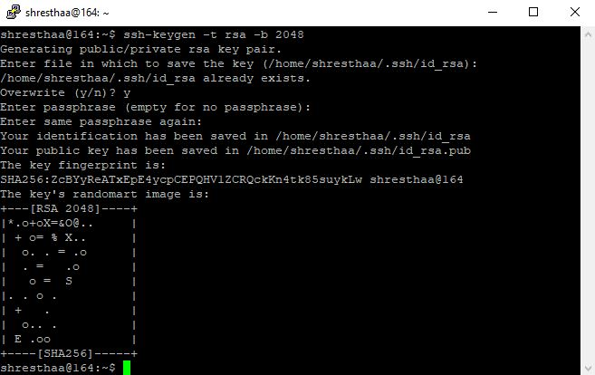
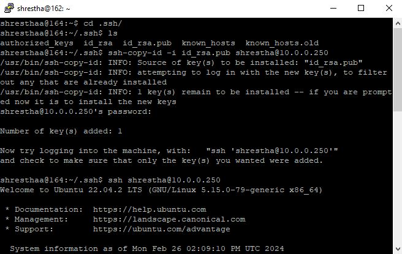
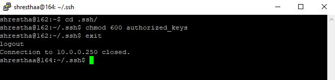

  

# Export Method

 

## **Windows to Linux connection to same user**

 

To connect from a Windows machine to a Linux server using PuTTY and a key pair generated with PuTTYgen, follow these steps:

**1. Generate a Key Pair with PuTTYgen:**

* Open PuTTYgen.
* Click on the "Generate" button to create a new key pair.
* Follow the instructions to generate the key pair.
* Save the private key (.ppk) and public key (.pub) in a text file in your Windows machine.

**2. Log in to your Linux server.**

* Change the directory to .ssh/.
* If the .ssh directory doesn't exist, execute ssh localhost and follow the prompt.
* Open or create the authorized_keys file in the .ssh directory: vi authorized_keys.
* Paste the content of the public key (.pub) generated by PuTTYgen into this file.
* Save and close the file.
* Set Permissions on the authorized_keys file:
 chmod 600 ~/.ssh/authorized_keys

**3. Configure PuTTY to Use the Private Key:**

* Open PuTTY.
* In the "Category" pane, navigate to "Connection" -> "SSH" -> "Auth".
* Browse and select the private key (.ppk) file you generated with PuTTYgen.

* Go back to the "Session" category.
* Enter the IP address or hostname of your Linux server.
* Save these settings if you want to reuse them.

**4. Connect to Linux Server:**

* Click on "Open" to establish the SSH connection.
* If everything is configured correctly, you should be logged in to your Linux server as the specified user    using the private key for authentication.

Ensure that the user you're connecting as, on the Linux server has appropriate permissions and access rights. If you encounter any issues, double-check the file permissions and ensure the public key is correctly added to the authorized_keys file.

 

 

## **Windows to Linux connection to different user**

 

To connect from a Windows machine to a Linux server using PuTTY and a key pair generated with PuTTYgen for a different user, you'll need to follow these steps:

**1. Generate a Key Pair with PuTTYgen:**

* Open PuTTYgen.
* Click on the "Generate" button to create a new key pair.
* Follow the instructions to generate the key pair.
* Save the private key (.ppk) and public key (.pub) as a text file to your Windows machine.

**2. Add Public Key to Linux User's authorized_keys file:**

* Log in to your Linux server with your current user credentials.
* Switch to the user account you want to switch to using the su command:su - username
* Replace username with the desired user's username.
* Change directory to .ssh/. If the .ssh directory doesn't exist in the home directory of the user,ssh localhost and follow the prompt.
* Open or create the authorized_keys file in the .ssh directory:vi authorized_keys
* Paste the content of the public key (.pub) generated by PuTTYgen into this file.
* Save and close the file.
* Set Permissions on the authorized_keys file:
  chmod 600 ~/.ssh/authorized_keys

**3. Configure PuTTY to Use the Private Key:**

* Open PuTTY.
* In the "Category" pane, navigate to "Connection" -> "SSH" -> "Auth".
* Browse and select the private key (.ppk) file you generated for another user with PuTTYgen.
* Go back to the "Session" category.
* Enter the IP address or hostname of your Linux server.
* Specify the port if it's not the default SSH port (22).
* Save these settings if you want to reuse them.

**4. Connect to Linux Server:**

* Click on "Open" to establish the SSH connection.
* PuTTY will use the private key for authentication, and if everything is configured correctly, you can login to another username@hostname .

Ensure that the user you're connecting to on the Linux server has appropriate permissions and access rights. If you encounter any issues, double-check the file permissions and ensure the public key is correctly added to the authorized_keys file for the desired user.

 

## **Linux to Linux connection to same user**

 

To generate SSH keys on a Linux client and set up trusted connection to linux server, you can follow these steps:

**1. Generate SSH Key Pair:**

* Run the following command on the terminal of the source Linux machine:
ssh-keygen -t rsa -b 2048
* You'll be prompted to choose the file location to save the keys. Press Enter to save in the default location (~/.ssh/id_rsa) or specify a custom location.
* It will also prompt you to enter a passphrase for added security. You can leave it blank if you don't want to use a passphrase.
* Change directory to .ssh/.
* Copy the public key id_rsa.pub in text file.

**2. Copy the Public Key to the Destination Machine:**

* Use ssh username@hostname (or IP address) to log into the destination linux machine. Replace user@hostname with the username and hostname (or IP address) of the destination machine.
* Copy the content of the public key file (~/.ssh/id_rsa.pub) to the authorized_keys file on the destination machine's ~/.ssh/ directory and exit.

**3. Test the Connection:**

* Try to SSH into the destination machine.Enter password for the first time. After that you shouldn't be prompted for a password.
ssh user@hostname
* You should now be able to log in without entering a password because your SSH key has been added to the authorized keys on the destination machine.

**4. Set permission:**

* Ensure the correct permissions are set:
  chmod 700 ~/.ssh/
  chmod 600 ~/.ssh/authorized_keys

 

By following these steps, you've generated an SSH key pair, added the public key to the destination machine, and established a trusted connection between the two Linux systems.

## **Linux to Linux connection to different user**

 

Here are the steps to generate SSH keys on a Linux system and set up trusted connection with destination Linux of another user :

**1. Generate SSH Key Pair on linux souce :**

* In the linux client, change directory :cd .ssh/.,if not present :ssh localhost and follow the prompt. User needs to generate the SSH key pair. This can be done by running the following command in their terminal:
ssh-keygen -t rsa -b 2048
* This command will prompt the user to choose a location to save the keys. Press Enter to save in the default location (~/.ssh/id_rsa) or specify a custom location. It will also ask for an optional passphrase for added security.
* Change directory :cd .ssh/.
* Copy the public key :cat id_rsa.pub and save it in a text file. 

**2. Share Public Keys:**

* ssh username@hostname (or IP address) to destination linux of another user. Replace user@hostname with the username and hostname (or IP address) of the other user's machine. Enter password of the other user's account. 
* Make a fake call to create .ssh/:ssh localhost and follow the prompt.
* Pate the public key file (~/.ssh/id_rsa.pub) of the source linux user to the authorized_keys file in the ~/.ssh/ directory of the other user's machine:vi authorized_keys and exit.

**3. Test the Connection:**

* In the source linux, user can now test the SSH connection to detination linux of another user :ssh user@hostname
* Replace user@hostname with the username and hostname (or IP address) of the other user's machine. Users will be prompted to enter password of destination linux user for the first time. After this we can log in without entering a password because the public key has been added to the other user's authorized_keys file.

**4. Set permission:**

* Ensure the correct permissions are set:
  chmod 700 ~/.ssh/
  chmod 600 ~/.ssh/authorized_keys

By following these steps, user can generate SSH keys, share their public key with another user, and establish trusted connections between their accounts on Linux systems.

## Linux to Linux connection to different user using a tool ssh-copy-id.

To establish a passwordless SSH connection from one Linux machine to another for a different user, you can use the ssh-copy-id command. This command is used to copy the public key of the local user to the remote user's authorized_keys file, enabling passwordless SSH authentication.

Here's a step-by-step guide:

**1. Generate SSH Key :**

* Log into your source Linux client.
* Change directory:cd .ssh/. If not present . ssh localhost and follow the prompt.
* Generate an SSH key pair, you can do so by running:
  ssh-keygen -t rsa -b 2048
* Follow the prompts to generate the key pair. This will create a public key (id_rsa.pub) and a private key
(id_rsa) in the ~/.ssh/ directory by default.
* Change directory:cd .ssh/.  

**2. Copy the Public Key to Remote Machine:**

* Use ssh-copy-id to copy the public key to linux server of another user's authorized_keys file.
* Replace remote_user and remote_host with the appropriate values:
  ssh-copy-id -i id_rsa.pub remote_user@remote_host
* This command will prompt you for the linux server password of the other user.

**3. Authenticate:**

* Enter the password when prompted. This will copy the linux client public key to the linux server of the other user's authorized_keys file, allowing you to authenticate without a password.

**4. SSH Connection without Password:**

* After completing the above steps, you should be able to SSH to another user's remote machine without being prompted for a password:
ssh remote_user@remote_host_or_IP

Remember to replace remote_user and remote_host with the appropriate values for your setup. Additionally, ensure that the remote user has proper permissions set for the .ssh directory (700) and the authorized_keys file (600).

