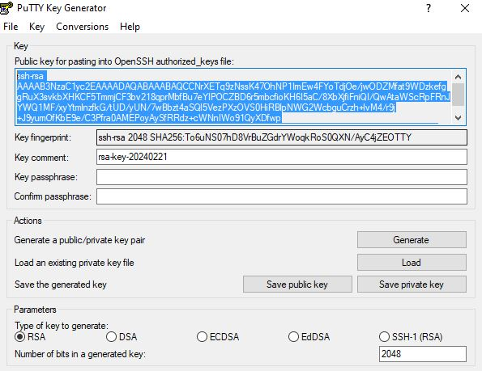

## Export Method

 

### Windows to Linux connection to own user

STEP 1:

1.Launch PuTTYgen.
2.Click on the 'Generate' button to create a new key pair.
3.Follow the instructions to generate randomness by moving the mouse within the PuTTYgen window.
4.Once the key pair is generated, you can set a passphrase to protect the private key (optional but recommended).
5.Save the public and private keys to your local machine.

STEP 2:

1. Log in to your Unix server using PuTTY 
and enter Host Name
2. Create the ~/.ssh directory if it doesn't exist:
3. Append the contents of the public key (from PuTTYgen) to the ~/.ssh/authorized_keys file on the server.
4. Make sure the ~/.ssh directory has proper permissions (700) and the authorized_keys file has the correct permissions (600).

STEP 3:

1.In the 'Connection' -> 'SSH' -> 'Auth' category, browse and select the private key file you saved .
2.Save these settings if you want to use them again in the future.
3.Click 'Open' to establish the SSH connection to the server for keyless authentication.

 

### Windows to Linux connection to different user

 

### Linux to Linux connection to own user

 

### Linux to Linux connection to different user

 

