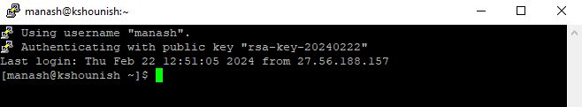

 

# Export Method

 

## Windows to Linux connection to same user

To connect from a Windows machine to a Linux server using PuTTY and a key pair generated with PuTTYgen, follow these steps:

1. Generate a Key Pair with PuTTYgen:

Open PuTTYgen.
Click on the "Generate" button to create a new key pair.
Follow the instructions to generate the key pair.
Save the private key (.ppk) and public key (.pub) to your Windows machine.
Add Public Key to Linux User's Authorized Keys:

2. Log in to your Linux server.

Navigate to the home directory of the user you want to connect as (cd ~username).
If the .ssh directory doesn't exist, create it: mkdir -p ~/.ssh
Open or create the authorized_keys file in the .ssh directory: nano ~/.ssh/authorized_keys
Paste the content of the public key (.pub) generated by PuTTYgen into this file.
Save and close the file.
Set Permissions on the authorized_keys file:

Ensure the correct permissions are set:
chmod 700 ~/.ssh
chmod 600 ~/.ssh/authorized_keys

3. Configure PuTTY to Use the Private Key:

Open PuTTY.
In the "Category" pane, navigate to "Connection" -> "SSH" -> "Auth".
Browse and select the private key (.ppk) file you generated with PuTTYgen.

Go back to the "Session" category.
Enter the IP address or hostname of your Linux server.
Specify the port if it's not the default SSH port (22).
Save these settings if you want to reuse them.
Connect to Linux Server:

Click on "Open" to establish the SSH connection.
If everything is configured correctly, you should be logged in to your Linux server as the specified user using the private key for authentication.

Ensure that the user you're connecting as on the Linux server has appropriate permissions and access rights. If you encounter any issues, double-check the file permissions and ensure the public key is correctly added to the authorized_keys file.

 

------------------------------------------------------------------------------------------------------------
 

## Windows to Linux connection to different user

 

To connect from a Windows machine to a Linux server using PuTTY and a key pair generated with PuTTYgen for a different user, you'll need to follow these steps:

1. Generate a Key Pair with PuTTYgen:

Open PuTTYgen.
Click on the "Generate" button to create a new key pair.
Follow the instructions to generate the key pair.
Save the private key (.ppk) and public key (.pub) to your Windows machine.

2. Add Public Key to Linux User's Authorized Keys:

Log in to your Linux server with your current user credentials.
Switch to the user account you want to connect to (if it's different from your current user) using the su command:su - username

Replace username with the desired user's username.
If the .ssh directory doesn't exist in the home directory of the user, create it:mkdir -p ~/.ssh

Open or create the authorized_keys file in the .ssh directory:nano ~/.ssh/authorized_keys

Paste the content of the public key (.pub) generated by PuTTYgen into this file.
Save and close the file.
Set Permissions on the .ssh directory and authorized_keys file:
Ensure the correct permissions are set:
chmod 700 ~/.ssh
chmod 600 ~/.ssh/authorized_keys

3. Configure PuTTY to Use the Private Key:

Open PuTTY.
In the "Category" pane, navigate to "Connection" -> "SSH" -> "Auth".
Browse and select the private key (.ppk) file you generated with PuTTYgen.
Go back to the "Session" category.
Enter the IP address or hostname of your Linux server.
Specify the port if it's not the default SSH port (22).
Save these settings if you want to reuse them.

4. Connect to Linux Server:

Click on "Open" to establish the SSH connection.
PuTTY will use the private key for authentication, and if everything is configured correctly, you should be logged in to your Linux server as the specified user.

Ensure that the user you're connecting to on the Linux server has appropriate permissions and access rights. If you encounter any issues, double-check the file permissions and ensure the public key is correctly added to the authorized_keys file for the desired user.

--------------------------------------------------------------------------------------------------------------

## Linux to Linux connection to same user

 

To generate SSH keys on a Linux system and set up trusted connections between systems, you can follow these steps:

1. Generate SSH Key Pair:

Run the following command on the terminal of the source Linux machine:
ssh-keygen -t rsa -b 2048

You'll be prompted to choose the file location to save the keys. Press Enter to save in the default location (~/.ssh/id_rsa) or specify a custom location.

It will also prompt you to enter a passphrase for added security. You can leave it blank if you don't want to use a passphrase.

2. Copy the Public Key to the Destination Machine:

Use ssh-copy-id command to copy the public key to the destination machine. Replace user@hostname with the username and hostname (or IP address) of the destination machine.
ssh-copy-id user@hostname

It will prompt for the password of the destination machine's user account. Enter the password.

If ssh-copy-id is not available on your system, you can manually append the content of the public key file (~/.ssh/id_rsa.pub) to the authorized_keys file on the destination machine's ~/.ssh/ directory.

3. Test the Connection:

Try to SSH into the destination machine. You shouldn't be prompted for a password.
ssh user@hostname

You should now be able to log in without entering a password because your SSH key has been added to the authorized keys on the destination machine.

4. Secure the Key Files:

Make sure your private key (id_rsa) remains secure. Set the correct permissions on the private key file to restrict access:
chmod 600 ~/.ssh/id_rsa

By following these steps, you've generated an SSH key pair, added the public key to the destination machine, and established a trusted connection between the two Linux systems.

### Linux to Linux connection to different user

 
Here are the steps to generate SSH keys on a Linux system and set up trusted connections between different users:

1. Generate SSH Key Pair for Each User:

Each user needs to generate their own SSH key pair. They can do this by running the following command in their terminal:
ssh-keygen -t rsa -b 2048

This command will prompt the user to choose a location to save the keys. Press Enter to save in the default location (~/.ssh/id_rsa) or specify a custom location. It will also ask for an optional passphrase for added security.

2. Share Public Keys:

Each user needs to share their public key with the other users they want to establish a trusted connection with. They can do this by copying their public key to the other user's authorized_keys file.
ssh-copy-id user@hostname

Replace user@hostname with the username and hostname (or IP address) of the other user's machine. This command will prompt for the password of the other user's account and copy the public key to their authorized_keys file.

If ssh-copy-id is not available, users can manually append the content of their public key file (~/.ssh/id_rsa.pub) to the authorized_keys file in the ~/.ssh/ directory of the other user's machine.

3. Test the Connection:

Users can now test the SSH connection between their accounts without being prompted for a password:
ssh user@hostname
Replace user@hostname with the username and hostname (or IP address) of the other user's machine. Users should now be able to log in without entering a password because their SSH keys have been added to the other user's authorized_keys file.

4. Secure the Key Files:

Ensure that each user's private key (id_rsa) remains secure by setting the correct permissions:
chmod 600 ~/.ssh/id_rsa

This command ensures that only the owner has read and write permissions to the private key file.

By following these steps, users can generate SSH keys, share their public keys with other users, and establish trusted connections between their accounts on Linux systems.

