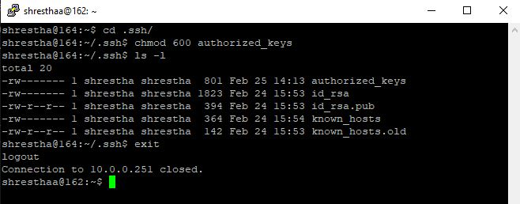

  

# Export Method

 

## **Windows to Linux connection to same user**

 

To connect from a Windows client to a Linux server using PuTTY and a key pair generated with PuTTYgen, follow these steps:

**1. Generate a Key Pair with PuTTYgen:**

* Open PuTTYgen.
* Click on the "Generate" button to create a new key pair.
* Follow the instructions to generate the key pair.
* Save the private key (.ppk).

**2. Log in to your Linux server.**

* Launch PuTTY. Enter `username@host_name_or_IP` in the Hostname field. Click on open.
* Change the directory: `cd .ssh/`.
* If the .ssh directory doesn't exist, execute `ssh localhost` and follow the prompt.
* Open or create the authorized_keys file in the .ssh directory: `vi authorized_keys`.
* Copy and paste the content of the public key into this file.
* Save and close the file.
* Set Permissions on the authorized_keys file:
 `chmod 600 authorized_keys`
 

**3. Configure PuTTY to Use the Private Key:**

* Open PuTTY.
* In the "Category" pane, navigate to "Connection" -> "SSH" -> "Auth" ->"credential".
* Browse and select the private key (.ppk) file you generated with PuTTYgen.

* Go back to the "Session" category.
* Enter the `username@hostname` of your Linux server.
* Save these settings if you want to reuse them.

**4. Connect to Linux Server:**

* Click on "Open" to establish the SSH connection.
* If everything is configured correctly, you should be logged in to your Linux server as the specified user    using the private key for authentication.

Ensure that the user you're connecting as, on the Linux server has appropriate permissions and access rights. If you encounter any issues, double-check the file permissions and ensure the public key is correctly added to the authorized_keys file.

 

 

## **Windows to Linux connection to different user**

 

To connect from a Windows client to a Linux server using PuTTY and a key pair generated with PuTTYgen to a different user, you'll need to follow these steps:

**1. Generate a Key Pair with PuTTYgen:**

* Open PuTTYgen.
* Click on the "Generate" button to create a new key pair.
* Follow the instructions to generate the key pair.
* Save the private key (.ppk).

**2. Add Public Key to Linux User's authorized_keys file:**

* Login to PuTTY with your `username@hostname`.
* Switch the user using su command:`su - username`
* Replace username with the desired user's username.
* Enter password of that user.
* Change directory: `cd .ssh/`. If the .ssh directory doesn't exist in the home directory of the user,`ssh localhost` and follow the prompt.
* Open or create the authorized_keys file in the .ssh directory:`vi authorized_keys`
* Copy and paste the content of the public key generated by PuTTYgen into this file.
* Save and close the file.
* Set Permissions on the authorized_keys file:
  `chmod 600 authorized_keys`

**3. Configure PuTTY to Use the Private Key:**

* Launch PuTTY.
* In the "Category" pane, navigate to "Connection" -> "SSH" -> "Auth" -> credential.
* Browse and select the private key (.ppk) file you generated for the other user with PuTTYgen.
* Go back to the "Session" category.
* Enter the `username@hostname` of the other user.
* Specify the port if it's not the default SSH port (22).
* Save these settings if you want to reuse them.

**4. Connect to Linux Server:**

* Click on "Open" to establish the SSH connection.
* PuTTY will use the private key for authentication, and if everything is configured correctly, you can login to another username@hostname .

Ensure that the user you're connecting to on the Linux server has appropriate permissions and access rights. If you encounter any issues, double-check the file permissions and ensure the public key is correctly added to the authorized_keys file for the other user.

 

## **Linux to Linux connection to same user**

 

To generate SSH keys on a Linux client and set up trusted relationship to linux server, we can follow these steps:

**1. Generate SSH Key Pair:**

* Launch PuTTY. Enter `username@hostname` in the HostName field. Click on open.
* Run the following command: `ssh-keygen -t rsa -b 1024`
* You'll be prompted to choose the file location to save the keys. Press Enter to save in the default location (~/.ssh/id_rsa).
* It will also prompt you to enter a passphrase for added security. You can leave it blank if you don't want to use a passphrase.
* Change directory: `cd .ssh/` or `ssh localhost` if directory is not present.
* Copy the public key id_rsa.pub :`cat id_rsa.pub`.

**2. Copy the Public Key to the Destination Machine:**

* Use `ssh username@hostname_or_IP` to log into the linux server. Replace user@hostname with the username and hostname (or IP address) of the linux server.
* Enter password:
* Change directory:`cd .ssh`. If not present. Make a fake call: `ssh localhost` and follow the prompt.
* Create authorized_keys file in (~/.ssh/) :`vi authorized_keys`.
* Copy the content of the public key file (~/.ssh/id_rsa.pub) to the authorized_keys file on the linux server  and exit.

**3. Test the Connection:**

* Try to SSH into the linux server:`ssh user@hostname`
* You should now be able to log into the linux server without entering a password.

**4. Set permission:**

* Ensure the correct permissions are set:
  `chmod 700 ~/.ssh/`
  `chmod 600 ~/.ssh/authorized_keys`

 

By following these steps, you've generated an SSH key pair, added the public key to the linux server, and established a trusted relationship from linux client to linux server.

## **Linux to Linux connection to different user**

 

Here are the steps to generate SSH keys on a Linux client and set up trusted relationship with Linux server to another user :

**1. Generate SSH Key Pair on linux client :**

* Launch PuTTY, Enter HostName and Click open, Enter password, Change directory : `cd .ssh/`., if not present : `ssh localhost` and follow the prompt. Run the following command: `ssh-keygen -t rsa -b 1024` to generate the keys.
* This command will prompt the user to choose a location to save the keys. Press Enter to save in the default location (~/.ssh/id_rsa). It will also ask for an optional passphrase for added security.
* Change directory:`cd .ssh/` if not changed.
* Copy the public key :`cat id_rsa.pub`. 

**2. Share Public Keys:**

* `ssh username@hostname_or_IP` to linux server of another user. Replace user@hostname with the username and hostname (or IP address) of the other linux user. Enter password of the other user. 
* Change directory:`cd .ssh/` .If not present make a fake call to create .ssh/:`ssh localhost` and follow the prompt.
* Pate the public key of the linux client to the authorized_keys file in the ~/.ssh/ directory of the other user's linux server:`vi authorized_keys` and exit.

**3. Test the Connection:**

* In the linux client, test the SSH connection to linux server of another user :`ssh user@hostname` .Replace user@hostname with the username and hostname (or IP address) of the other user's linux server.
* You should now be able to log into the linux server of the other user without the password.

**4. Set permission:**

* Ensure the correct permissions are set:
  `chmod 700 ~/.ssh/`
  `chmod 600 ~/.ssh/authorized_keys`

By following these steps, user can generate SSH keys, share their public key with another user, and establish trusted relationship from linux client to linux server to another user.

## Linux to Linux connection using a tool ssh-copy-id.

To establish SSH connection from Linux client to Linux server, you can use the ssh-copy-id command. This command is used to copy the public key of the linux client to the linux server authorized_keys file, enabling SSH authentication without the password.

Here's a step-by-step guide:

**1. Generate SSH Key :**

* Launch PuTTY. Enter HostName. Click on Open. Log into your Linux client.
* Change directory:`cd .ssh/`. If not present . `ssh localhost` and follow the prompt.
* Generate an SSH key pair, run command: `ssh-keygen -t rsa -b 1024`
* Follow the prompts to generate the key pair. This will create a public key (id_rsa.pub) and a private key
(id_rsa) in the ~/.ssh/ directory by default.
* Change directory:`cd .ssh/` if not changed.  

**2. Copy the Public Key to Remote Machine:**

* Use ssh-copy-id to copy the public key to linux server authorized_keys file.
* Replace remote_user and remote_host with the appropriate values:
 `ssh-copy-id -i id_rsa.pub remote_user@remote_host_or_IP`.
* This command will prompt you for the linux server password.

**3. Authenticate:**

* Enter the password when prompted. This will copy the linux client public key to the linux server authorized_keys file, allowing us to authenticate without a password.

**4. SSH Connection without Password:**

* After completing the above steps, you should be able to SSH to linux server without being prompted for a password: `ssh remote_user@remote_host_or_IP`

Remember to replace remote_user and remote_host with the appropriate values for your setup. Additionally, ensure that the remote user has proper permissions set for the .ssh directory (700) and the authorized_keys file (600).

