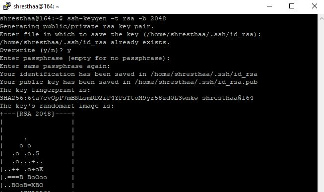
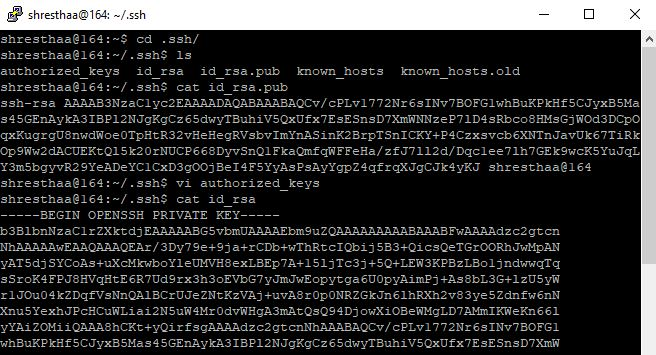
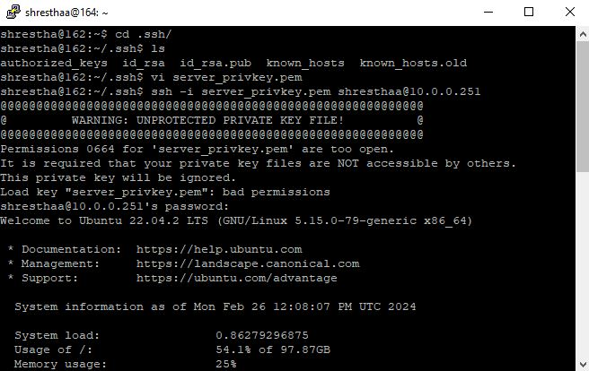
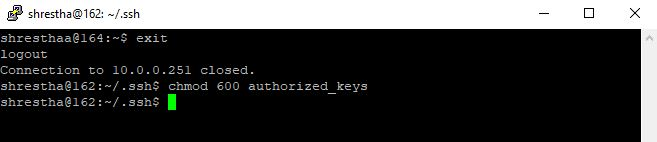

## Import Method

 

## Windows to Linux connection to same user

To establish an SSH connection from a Windows client to Linux server with server keys, you'll need to follow these steps:

**1. Generate SSH Key Pair on Linux Server:**

* Open putty and login to destination linux server.
* Change directory: cd .ssh/ .If not present :ssh localhost and follow the prompt. 
* Run the following command to generate the SSH key pair:
  ssh-keygen -t rsa -b 1024
* Follow the prompts to save the keys in the default directory (~/.ssh) or specify a custom location.

**2. Copy the Private Key to the Windows Client:**

* Once the keys are generated, you'll need to copy the public key (id_rsa.pub) and paste it into the authorized_keys file in the .ssh directory using cat command.
* Use cat command to view and copy the private key to your Windows machine as a text file.

**3. Configure PuTTY on Windows:**

* Open PuTTYgen (comes with PuTTY installation) on your Windows machine.
* Click on the "Load" button and select the private key text file you copied.
* Once the key is loaded, click on "Save private key" to save it in PuTTY's .ppk format.
* Close PuTTYgen after saving the private key.

**4. Load Private Key to PuTTY:**

* Open PuTTY.
* In the left-hand Category pane, navigate to Connection -> SSH -> Auth.
* Click on the "Browse" button and select the private key file (id_rsa.ppk) you generated with PuTTYgen.
* Go back to the Session category, enter username@hostname or (IP address) of your Linux server in the "Host Name" field, and save the session.

**5. Test SSH Connection:**

* Double-click the saved session in PuTTY to initiate the SSH connection.
* PuTTY should now connect to your Linux server using the SSH key pair you generated.

That's it! You've established an SSH connection from your Linux server to your Windows client using PuTTY. Make sure to replace placeholders like your_username and your_windows_ip with your actual values.

## Windows to Linux connection to different user

 

To establish an SSH connection from a Windows client to Linux server to a different user with server keys, you'll need to follow these steps:

**1. Generate SSH Key Pair on Linux Server:**

* Log into the remote linux :ssh username@hostname or(IP address).
*
* Run the following command to generate the SSH key pair:
  ssh-keygen -t rsa -b 1024
* Follow the prompts to save the keys in the default directory (~/.ssh).

**2. Copy the Private Key to the Windows Client:**

* Once the keys are generated, you'll need to use cat command to copy the public key (id_rsa.pub) and paste it into the authorized_keys file of the .ssh directory.
* Using cat command copy and paste the id_rsa private key to your Windows client as text file.

**3. Configure PuTTY on Windows:**

* Open PuTTYgen (comes with PuTTY installation) on your Windows machine.
* Click on the "Load" button and select the id_rsa.pub file you copied to your Windows desktop.
* Once the key is loaded, click on "Save private key" to save it in PuTTY's .ppk format.
* Close PuTTYgen after saving the private key.

**4. Load Private Key to PuTTY:**

* Open PuTTY.
* In the left-hand Category pane, navigate to Connection -> SSH -> Auth.
* Click on the "Browse" button and select the private key file (id_rsa.ppk) you generated with PuTTYgen.
* Go back to the Session category, enter the username@hostname or (IP address) of the other user in the "Host Name" field.

**5. Test SSH Connection:**

* Click on open.
* PuTTY should now connect your Windows client to the other linux user without the password.

That's it! You've established an SSH connection from you Windows client to linux server to another user.

## Linux to Linux connection to same user

 
To establish a trusted connection from your Linux client to a Linux server using SSH and key-based authentication to the same user by importing private key from server, we need to follow these steps:

**1. Generate SSH Key Pair on Server:**

* Log into your Linux server with password.
* Change directory:cd .ssh/. If not present. ssh localhost and follow the prompt.
* Run the following command to generate an SSH key pair:
  ssh-keygen -t rsa -b 2048
* Follow the prompts to generate the key pair. You can press Enter to accept the default file location and an optional passphrase for added security.

**2. Copy the Private Key to Client:**

* Once the keys are generated, you'll need to use cat command to copy the public key (id_rsa.pub) and paste it into the authorized_keys file of the .ssh directory.
* Using cat command copy the id_rsa private key and exit.
* In linux client, change the directory to .ssh/ .Create a new file using vi filename.pem and paste private key into the file.

**3. Test SSH Connection:**

* Login with password once, then ssh -i filename.pem username@hostname
* Set permission using chmod 600 authorized_keys.

  

## Linux to Linux connection to different user

 

To establish a connection from your Linux server to a Linux client using SSH and key-based authentication for the different user account, you'll need to follow these steps:

**1. Generate SSH Key Pair on Server:**

* Log in to Linux server of another user with the user's password.
* Change directory:cd .ssh/. If not present. ssh localhost and follow the prompt.
* Run the following command to generate an SSH key pair:
  ssh-keygen -t rsa -b 2048
* Follow the prompts to generate the key pair. You can press Enter to accept the default file location and an optional passphrase for added security.

**2. Copy the Private Key to Client:**

* Once the keys are generated, you'll need to use cat command to copy the public key (id_rsa.pub) and paste it into the authorized_keys file of the .ssh directory.
* Using cat command copy the id_rsa private key and save it in text file and exit.
* In linux client, change the directory to .ssh/ .Create a new file using vi filename.pem and paste private key into the file.

**3. Test SSH Connection:**

* You will be prompted to Login with password for the first time, then ssh -i filename.pem username@hostname
* Set permission using chmod 600 authorized_keys.

