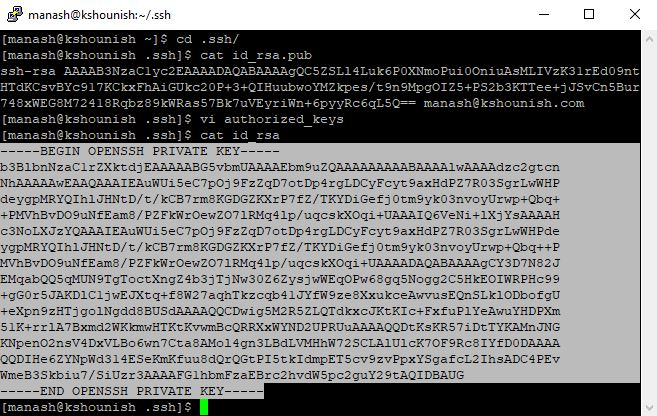

# Import Method  

## Windows to Linux connection to same user

To establish an SSH connection from a Windows client to Linux server with server keys, you'll need to follow these steps:

**1. Generate SSH Key Pair on Linux Server:**

* Launch PuTTY .Enter `username@hostname` in the HostName field . Click on Open.
* Change directory: `cd .ssh/` .If not present :`ssh localhost` and follow the prompt.
* Run the following command to generate the SSH key pair: `ssh-keygen -t rsa -b 1024`
* Follow the prompts to save the keys in the default directory (~/.ssh).

**2. Copy the Private Key to the Windows Client:**

* Once the keys are generated, you'll need to copy the public key: `cat id_rsa.pub`.
* Create a file authorized_keys in the directory (~/.ssh) : `vi authorized_keys` and paste the public key.
* Copy the private key to your Windows machine and save it in a text file: `cat id_rsa`.

**3. Configure PuTTY on Windows:**

* Open PuTTYgen (comes with PuTTY installation) on your Windows machine.
* Click on the "Load" button and select the private key text file you copied.
* Once the key is loaded, click on ok and "Save private key" to save it in PuTTY's .ppk format.
* Close PuTTYgen after saving the private key.

**4. Load Private Key to PuTTY:**

* Launch PuTTY.
* In the left-hand Category pane, navigate to Connection -> SSH -> Auth -> credential.
* Click on the "Browse" button and select the private key file (id_rsa.ppk) you generated with PuTTYgen.
* Go back to the Session category, enter `username@hostname` or (IP address) of your Linux server in the "Host Name" field, and save the session.

**5. Test SSH Connection:**

* Double-click the saved session in PuTTY to initiate the SSH connection.
* PuTTY should now connect to your Linux server using the server generated key pairs.

That's it! You've established an SSH connection from your Windows client to Linux server using server generated keys. Make sure to replace placeholders like your_username and hostname_or_IP with your actual values.

**Video for windows to linux trusted relationship to same user using ssh-keygen**

 

## Windows to Linux connection to different user

To establish an SSH connection from a Windows client to Linux server to a different user with server keys, you'll need to follow these steps:

**1. Generate SSH Key Pair on Linux Server:**

* Launch PuTTY. Enter `username@hostname` in the HostName field. Click on Open.
* Enter password.
* Switch the user using su command: `su - username` .Replace username with the desired user's username.
* Enter password of that user.
* Change directory : `cd .ssh/` .
* Run the following command to generate the SSH key pair:
  `ssh-keygen -t rsa -b 1024`
* Follow the prompts to save the keys in the default directory (~/.ssh).

**2. Copy the Private Key to the Windows Client:**

* Once the keys are generated, you'll need to copy the public key: `cat id_rsa.pub`.
* Create a file authorized_keys in the directory (~/.ssh) : `vi authorized_keys` and paste the public key.
* Copy the private key to your Windows machine and save it in a text file: `cat id_rsa`.

**3. Configure PuTTY on Windows:**

* Open PuTTYgen (comes with PuTTY installation) on your Windows machine.
* Click on the "Load" button and select the public key (id_rsa.pub) text file you copied.
* Once the key is loaded, click on ok and "Save private key" to save it in PuTTY's .ppk format.
* Close PuTTYgen after saving the private key.

**4. Load Private Key to PuTTY:**

* Open PuTTY.
* In the left-hand Category pane, navigate to Connection -> SSH -> Auth -> credential.
* Click on the "Browse" button and select the private key file (id_rsa.ppk) you generated with PuTTYgen.
* Go back to the Session category, enter the `username@hostname` or (IP address) in the "Host Name" field.

**5. Test SSH Connection:**

* Click on open.
* PuTTY should now connect your Windows client to the other Linux user without the password.

That's it! You've established an SSH connection from you Windows client to linux server to another user.

**Video for windows to linux trusted relationship to different user using ssh-keygen**

 

## Linux to Linux connection to same user

To establish a trusted connection from your Linux client to a Linux server using SSH and key-based authentication to the same user by importing private key from server, we need to follow these steps:

**1. Generate SSH Key Pair on Server:**

* Launch PuTTY. Enter `username@hostname` in the HostName field. Click on Open.
* Enter password.
* `ssh username@hostname_or_IP` to login to linux server.
* Login with password.
* Change directory: `cd .ssh/` . If not present. `ssh localhost` and follow the prompt.
* Run the following command to generate an SSH key pair: `ssh-keygen -t rsa -b 1024`
* Follow the prompts to generate the key pair. You can press Enter to accept the default file location and an optional passphrase for added security.

**2. Copy the Private Key to Client:**

* Change directory: `cd .ssh/` if not changed.
* `ls` to list file in .ssh/ directory.
* Once the keys are generated, you'll need to copy the public key: `cat id_rsa.pub`.
* Create a file or edit authorized_keys in the directory (~/.ssh) : `vi authorized_keys` and paste the public key.
* Set permission `chmod 600 authorized_keys` file.
* Copy the private key : `cat id_rsa`
* `ssh username@hostname_or_IP` to login to linux client.
* Enter password:
* Change directory: `cd .ssh/` .
* Open vi editor and paste the private key : `vi serverprivatekey.pem`

**3. Test SSH Connection:**

* `ssh -i filename.pem username@hostname`
* This command will prompt to enter the password  on first login. Enter password.

  

**Video for linux to linux trusted relationship to same user using ssh-keygen**

 

## Linux to Linux connection to different user

To establish a connection from your Linux client to a Linux server using SSH and key-based authentication for a different user , you'll need to follow these steps:

**1. Generate SSH Key Pair on Server:**

* Launch PuTTY. Enter `username@hostname` in the HostName field. Click on Open.
* Enter password.
* `ssh username@hostname_or_IP` to login to linux server of another user.
* Login with password of other user.
* Change directory: `cd .ssh/` . If not present. `ssh localhost` and follow the prompt.
* Run the following command to generate an SSH key pair: `ssh-keygen -t rsa -b 1024`
* Follow the prompts to generate the key pair. You can press Enter to accept the default file location and an optional passphrase for added security.

**2. Copy the Private Key to Client:**

* Change directory: `cd .ssh/` if not changed.
* Once the keys are generated, you'll need to copy the public key: `cat id_rsa.pub`.
* Create a file or edit authorized_keys in the directory (~/.ssh) : `vi authorized_keys` and paste the public key.
* Copy the private key : `cat id_rsa`
* `ssh username@hostname_or_IP` to login to linux client.
* Enter password:
* Change directory: `cd .ssh/` .
* Open vi editor and paste the private key : `vi serverprivkey.pem`

**3. Test SSH Connection:**

* `ssh -i serverprivatekey.pem username@hostname` to login to linux server to different user.
* This command will prompt to enter the password  on first login. Enter password.

**Video for linux to linux trusted relationship to different user using ssh-keygen**

